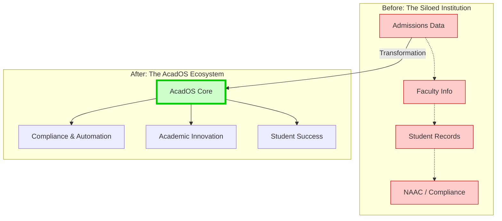

# AcadOS: The Academic Operating System
### We are not just building software. We are building the scaffolding for India's educational future.

    <a href="#-the-burning-platform">The Vision</a> •
    <a href="#-the-acados-ecosystem">The Platform</a> •
    <a href="#-the-blueprint-for-execution">The Plan</a> •
    <a href="#-join-our-mission">The Community</a>

    
    
    

---

## Vision: The Burning Platform
### 🔥 The Problem Runs Deeper Than Paperwork

The National Education Policy (NEP) 2020 isn't just a recommendation; it's a paradigm shift. Yet, the tools available to our educational institutions belong to a bygone era. The result is a system under immense pressure, impacting everyone involved.

<strong>Click to see the pain points for each stakeholder...</strong>

| Stakeholder | The Daily Struggle (The "Before") |
| :--- | :--- |
| 🎓 **Students** | Navigating a rigid curriculum with no clear link between courses and career skills. The learning experience feels passive and disconnected from the real world. |
| 🧑‍🏫 **Faculty** | Drowning in administrative tasks and compliance paperwork. They have the desire to innovate but lack the time and the right tools for modern pedagogy. |
| 🏢 **Administrators** | Flying blind with data scattered across spreadsheets and legacy systems. Making strategic decisions is based on guesswork, and preparing for accreditation is a recurring nightmare. |
| 📈 **Leadership/Trustees** | Facing intense competition for admissions and reputation. They struggle to differentiate their institution and demonstrate tangible ROI to parents and stakeholders. |

### 🌱 Our Philosophy: The Principles Behind the Platform

AcadOS is more than just features; it's a philosophy for institutional excellence.

-   **Seamless Integration over Silos:** We believe the true power of data is unlocked when systems talk to each other. From admissions to alumni, we create a single source of truth.
-   **Empowerment over Control:** Our tools are designed to give autonomy back to faculty and students, fostering a culture of ownership, creativity, and innovation.
-   **Actionable Insights over Raw Data:** We don't just show you data; we provide clear, visual dashboards that help you make faster, smarter decisions for institutional growth.
-   **Human-Centric Design:** If it's not intuitive, it won't be used. Every screen, button, and workflow is designed with the end-user in mind, ensuring rapid adoption and minimal training.

---

## The Platform: The AcadOS Ecosystem
### 💡 From Fragmented Chaos to a Unified Ecosystem

We transform your institution's digital infrastructure from a collection of disconnected islands into a seamlessly integrated, intelligent whole.

### ⚙️ Core Modules: A Deep Dive into the Toolkit

Our platform is a suite of powerful, interconnected modules. Click on each to explore its features and benefits.

<strong>MODULE 1: The Compliance & Automation Engine 🚀</strong>

> **Solves the #1 headache: Governance and Accreditation.**

| Feature | Benefit for Your Institution |
| :--- | :--- |
| **Real-time NAAC/NBA Dashboard** | Go from a 6-month accreditation scramble to being "audit-ready" every single day. Dramatically improve your grade by showcasing data-backed improvements. |
| **AI-Powered Timetabling** | Generate clash-free, optimized timetables for the entire institution in hours, not weeks. Maximize resource utilization. |
| **Faculty Workload & Performance Analytics** | Ensure equitable workload distribution and identify high-performing faculty based on a holistic set of parameters beyond just API scores. |
| **One-Click Regulatory Reporting** | Automate the generation of reports for UGC, AICTE, etc., freeing up hundreds of hours of senior staff time for more strategic work. |

<strong>MODULE 2: The Academic Innovation Hub 🧠</strong>

> **Where the NEP vision of multidisciplinary, skill-based learning comes alive.**

| Feature | Benefit for Your Institution |
| :--- | :--- |
| **Curriculum & Course Designer** | Visually design and launch flexible, interdisciplinary programs (Majors/Minors) that attract modern learners and meet industry demands. |
| **Skills & Outcome Mapping** | Go beyond marks. Tag every course, assignment, and project with specific skills. Prove to recruiters and parents that your graduates are job-ready. |
| **Project-Based Learning (PBL) Workspace** | Foster teamwork, critical thinking, and creativity. Allow faculty to manage complex projects and even invite industry mentors to participate. |
| **Dynamic Student "Skill Transcript"** | An auto-generated, verifiable transcript that showcases a student's acquired skills, providing a powerful supplement to their traditional marksheet. |

<strong>MODULE 3: The Student Success & Placements Platform 📈</strong>

> **Closing the loop from education to employment.**

| Feature | Benefit for Your Institution |
| :--- | :--- |
| **AI-Powered Career Co-Pilot** | Increase student engagement and retention by providing them with a personalized roadmap, suggesting courses, projects, and internships for their target careers. |
| **Unified Placements & Industry CRM** | Supercharge your placement cell. Manage corporate relationships, track recruitment pipelines, and match students to opportunities using rich skill data. |
| **Alumni Mentorship Network** | Build a powerful, engaged alumni community. Facilitate mentorship connections that provide immense value to current students and strengthen alumni bonds. |
| **Automated Portfolio Builder** | Every student gets a professional, ready-to-share e-portfolio of their best work, projects, and skill assessments, giving them a huge edge in the job market. |

---

## The Plan: The Blueprint for Execution

### 💻 Technology Stack & Architecture

We are building a robust, secure, and scalable platform designed for the future.

<strong>Click to see our technology choices...</strong>

-   **Frontend:** React, TypeScript, Vite, TailwindCSS
-   **Backend:** Node.js (Express.js), Python (FastAPI for ML services)
-   **Database:** PostgreSQL (Relational), Redis (Caching), VectorDB (for AI features)
-   **Infrastructure:** Docker, Kubernetes, AWS (S3, EC2, RDS)
-   **CI/CD:** GitHub Actions, Terraform

### 🗺️ Our Ambitious Roadmap

*(Last Updated: August 28, 2025, from Panhala, MH)*

| Timeline      | Milestone                                                                   | Status      |
| :------------ | :-------------------------------------------------------------------------- | :---------- |
| **Q3 2025** | ✅ Alpha Version of Module 1 Complete                                       | `DONE`      |
| **Q4 2025** | ⏳ Onboarding "Vanguard" Pilot Cohort (Seeking 3-5 innovative HEIs in Maharashtra) | `IN PROGRESS` |
| **Q1 2026** | 🚀 Public Launch of AcadOS v1.0 (Compliance & Automation Engine)              | `UP NEXT`   |
| **Q3 2026** | 🧠 Launch Module 2 (Academic Innovation Hub)                                | `PLANNED`   |
| **Q4 2026** | 📈 Beta Launch of Module 3 (Student Success & Placements)                     | `PLANNED`   |
| **2027+** | 🌏 Expansion into new geographies and development of AI-driven adaptive learning pathways | `VISION`    |

---

## The Community: Join Our Mission
### Our Story

Born from countless conversations in the historic hills of Panhala, AcadOS is our answer to a simple, powerful question: **How can we empower the institutions and educators who are shaping India's future?** We are a team of technologists, educators, and dreamers committed to solving the toughest challenges in higher education.

### 🤝 Get Involved

**🎓 For Institutions:**
Are you a forward-thinking institution ready to lead the change? We are now accepting applications for our heavily-supported **"Vanguard" Pilot Program**. Be among the first to shape the future.
[**→ Register Your Interest for the Pilot Program**](mailto:vanguard@acados.com?subject=Inquiry:%20AcadOS%20Vanguard%20Pilot%20Program)

**💻 For Developers & Builders:**
This is more than a job; it's a mission. If you are a talented engineer, designer, or product manager who wants to make a lasting impact, we want to hear from you.
[**→ View Open Roles & Contribution Guide**](./CONTRIBUTING.md)

**💼 For Investors & Strategic Partners:**
We are seeking partners who share our vision of transforming Indian higher education at scale.
[**→ Request Our Investment Memo**](mailto:investors@acados.com?subject=Investment%20Inquiry:%20AcadOS)

---

    
<strong>AcadOS</strong> • Engineered in India, Built for India's Future.

    
© 2025 AcadOS. All Rights Reserved.

